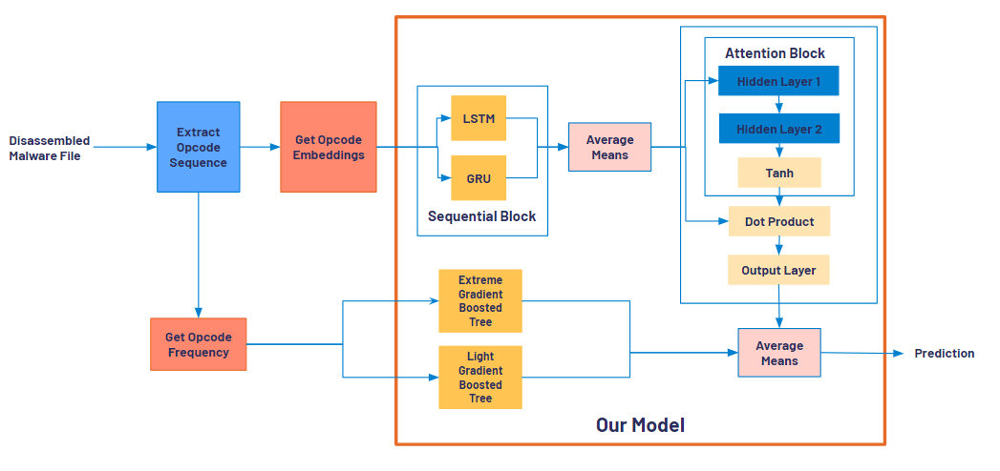
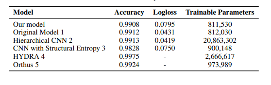
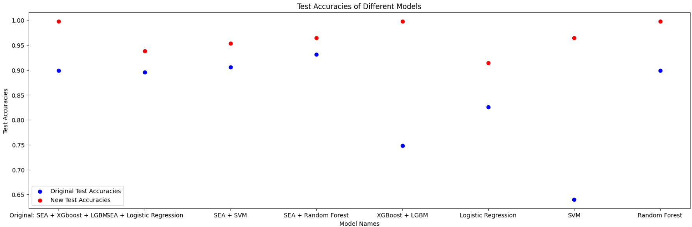
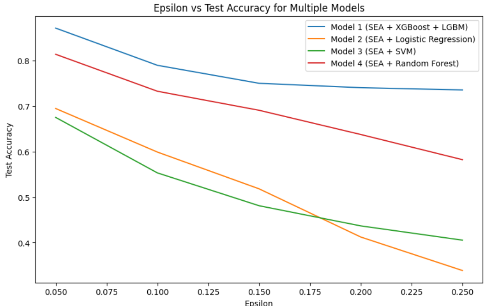
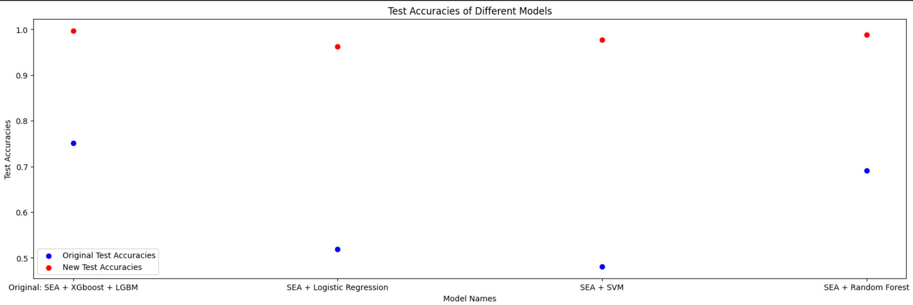
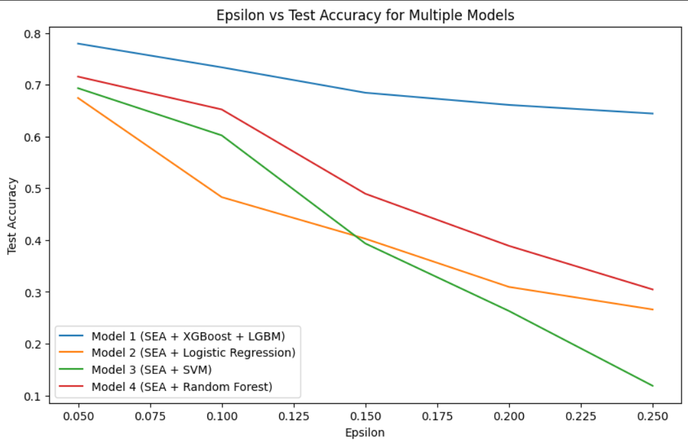
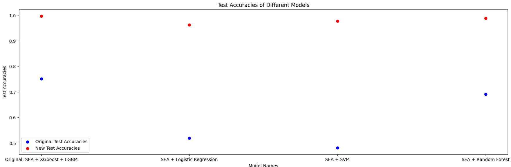
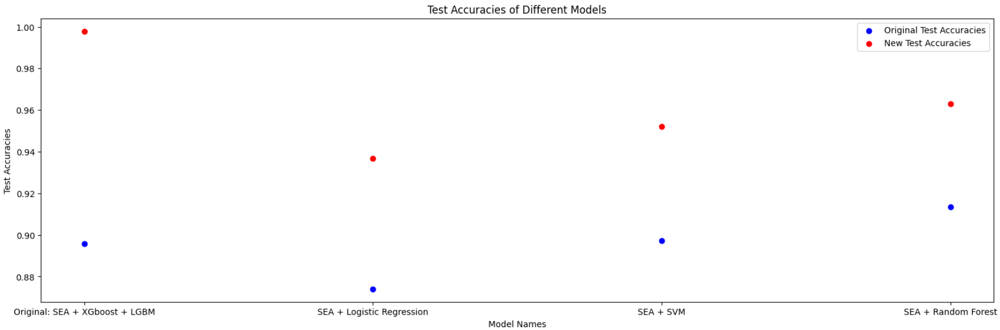

# Attack On Sequential Embedding-Driven Attentive Malware Classification
The objective of this project was to develop a compact model employing sequential opcode-based embeddings and an attention mechanism for classifying malware, assessing its resilience against diverse adversarial attack strategies. The study involves comparing the outcomes with alternative models. To enhance robustness against attacks, Adversarial Retraining and Ensemble Learning techniques were applied.

## Setup
Clone the repo. Download the datasets and models that could not be uploaded to GitHub due to upload limit and place them into appropriate folder.

## Prerequisites
Ensure you all the necessary libraries installed
- numpy
- pandas
- os
- time
- gc (garbage collector)
- sklearn (scikit-learn)
- lightgbm
- random
- warnings
- tqdm
- keras
- torch
- xgboost
- RandomForestClassifier
- metrics (from scikit-learn)
- LogisticRegression
- SVC (Support Vector Classification)
- confusion_matrix (from scikit-learn)
- seaborn
- matplotlib.pyplot
- pickle
- FastText (from gensim.models)
- PCA (Principal Component Analysis from scikit-learn)
- TSNE (t-Distributed Stochastic Neighbor Embedding from scikit-learn)

## How to Run
  1. Once you have all the necessary files downloaded and libraries installed you can simply run the notebooks and python files using and IDE of your choice.

## System Requirements
Google Pro High Memory Ram and GPU
    
## Dataset
The project utilizes the "Microsoft BIG 15" benchmark dataset. You cn download it from the link below:

https://www.kaggle.com/c/malware-classification

Warning: this dataset is almost half a terabyte uncompressed! They have compressed the data using 7zip to achieve the smallest file size possible.
They provided a set of known malware files representing a mix of 9 different families. Each malware file has an Id, a 20 character hash value uniquely identifying the file, and a Class, an integer representing one of 9 family names to which the malware may belong:

Ramnit
Lollipop
Kelihos_ver3
Vundo
Simda
Tracur
Kelihos_ver1
Obfuscator.ACY
Gatak

For each file, the raw data contains the hexadecimal representation of the file's binary content, without the PE header (to ensure sterility).  You are also provided a metadata manifest, which is a log containing various metadata information extracted from the binary, such as function calls, strings, etc. This was generated using the IDA disassembler tool.

## Model Architecture

Model is based on 

[M. Ahmed, A. Qureshi, J. Ahmed Shamsi, and M. Marvi, "Sequential Embedding-based Attentive
(SEA) classifier for malware classification," 2022 International Conference on Cyber Warfare and
Security (ICCWS), Islamabad, Pakistan, 2022](https://arxiv.org/pdf/2302.05728.pdf)

1. Learning Opcodes Embedding: The focus is on learning both context and semantics of
opcodes. Context refers to understanding how an opcode is used in a specific context, while
semantics involves learning a special representation vector for each opcode. We learn the
embeddings by sequentially passing the opcodes through a hidden layer, and then averaging
it for the entire sequence

2. Sequential Block: The sequential block processes the embeddings using LSTM cells to
capture long-term dependencies in extensive opcode sequences. The input gate filters out
irrelevant information by assigning importance scores through a sigmoid activation. These
scores are multiplied with the previous cell output to retain crucial details. The LSTM
processes information through a tanh activation, combining it with preserved data from the
forget gate. The output gate produces the final learned vector, passing it to the next cell
after a tanh activation.To address the vast data and enhance diversity, a parallel architecture
incorporates a GRU alongside LSTM. The GRU, a time-efficient alternative, complements
LSTM for comprehensive sequence understanding.

3. Averaging Mean Values: Two feature vectors are obtained from the LSTM and GRU,
representing opcode information, long-term relations, and hidden contextual patterns. These
vectors are combined by cascading their outputs to the same dimensions. A simple mean is
taken to center their means, eliminating extreme values.

4. Attention Block: The Attention Block is a pivotal component of the model architecture,
emphasizing the prioritization of important information while filtering out less critical
details. . This mechanism, lightweight yet effective, ensures that the model doesn’t overlook
the minority malicious parts while overly focusing on the majority bengin parts of the
opcode embedding. By preparing an attention vector and taking the dot product with the
embeddings, the model accurately assigns attention to the critical malicious part, contributing
to an accurate and efficient classification process. While this ends the Sequential Embeddings
based Attentive Classifier, for our project we combine it with Gradient Boosted Classifiers.

5. Gradient Boosted Classifiers: Two gradient boosted classifiers are employed to classify
the malware based on opcode frequency. This is in line with traditional methods which
focus on frequency and signature based analysis. The output from the attention block and
these classifiers are averaged to give a final prediction

## Attack Strategies
We attacked the model using the attack strategies mentioned below:
1. Append Attack: Append-based strategies tackle the semantic integrity constraints of PE
files by adding adversarial noise to the original file’s end. As this noise is appended at
the conclusion, it remains beyond the PE file boundary, ensuring it does not impact the file’s
execution. In this project, we applied this approach by adding 500 push commands to the
end of each opcode sequence as an adversarial attack.

2. FGSM Append Attack: The attack strategy is designed to underscore the vulnerabilities
of the model, particularly as adversarial leverage increases. Drawing inspiration from the
append-based approach, the FGSM Append Attack involves augmenting extracted opcode
sequences with push commands. Subsequently, these embeddings of these sequences are
updated using a policy guided by the Fast Gradient Sign Method (FGSM). In this method,
the attack leverages the classification loss (l) of the model’s output concerning the target
label. FGSM operates by adjusting each embedding value by a user-specified amount
(epsilon) in a direction that minimizes the classification loss on the input. This adjustment is
determined by the sign of the gradient, aligning with the overall objective of enhancing the
model’s susceptibility to adversarial inputs.

4. Rule Based Attack: The Rule-Based Attack method operates by adhering to a predefined
set of rules that guide the introduction of perturbations after each opcode in the sequence.
Following these rules, the generated embeddings undergo adjustments by a small value
epsilon, aligning with the direction that minimizes the loss—a methodology reminiscent of
the Fast Gradient Sign Method (FGSM) attack. In the context of our project, this strategy
entailed injecting additional push commands for each existing push command in the original
file. Additionally, extra XOR operations were introduced for every XOR command in the
sequence. Similar to the Append Attack, these injections are made only by setting the
rules such that the execution of the PE file is undisturbed. Subsequently, an FGSM attack
was applied to the adjusted embeddings, further exploiting the model’s vulnerability to
adversarial inputs through these rule-based modifications.

6. Feature-Importance Based Attack: In this approach, push commands are appended to
the end of the opcode sequences, resembling the Append Attack. However, the FeatureImportance Based Attack introduces complexity by assigning priority to values within the
embeddings based on their feature importance. Typically utilized for removing redundant
features and improving model training efficiency, the feature selection algorithm takes on
a unique role in this attack, contributing to the construction of adversarial samples. After
employing various feature selection algorithms, the attack ranks the features. Perturbations
are then applied to a small fraction of these prioritized values, representing the most crucial
features. In our project, feature importance was assessed by averaging scores from ANOVA
F-value, Information Gain, and the FDE feature selection algorithm. Following this, 20 out
of the total 100 values in the embedding space were updated, showcasing a focused and
well-informed adversarial strategy

## Results
Our model showcases competitive performance, boasting a commendable accuracy of 99.08% and a log
loss of 0.0795, with a moderate number of trainable parameters at 811,530. It’s noteworthy
that our model compares favorably with existing models. Each model excels in specific
aspects, but our approach strikes a balance, offering efficiency with fewer parameters while
maintaining high accuracy

### Append Attack
Test Accuracies without Retraining Defense and after Retraining Defense

### FGSM Append Attack
Performace of models as epsilon increases

Test Accuracies without Retraining Defense and after Retraining Defense (epsilon = 0.15)

### Rule-Based attack
Performace of models as epsilon increases

Test Accuracies without Retraining Defense and after Retraining Defense (epsilon = 0.15)

### Feature-Importance Based Attack
Test Accuracies without Retraining Defense and after Retraining Defense (features affected=20 update = 0.25)

